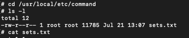

# Learn Redis

This repository is designed to help me learn about Redis, a powerful in-memory data store.

## Why Redis?

Redis offers a wide range of data structures and features, making it suitable for various use cases:

- **Caching:** Improve application performance by storing frequently accessed data in memory.
- **Session Management:** Store user sessions efficiently and securely.
- **Real-time Data:** Handle real-time data updates and notifications.
- **Leaderboards and Rankings:** Implement leaderboards and ranking systems.
- **Queues and Pub/Sub:** Build robust messaging and event-driven systems.

## Getting Started

1. **Install Redis:** Follow the instructions for your operating system: [https://redis.io/download](https://redis.io/download)
2. **Start Redis Server:** Run `redis-server` in your terminal.
3. **Connect to Redis:** Use a Redis client library or tool (e.g., `redis-cli`).

### Strings

```sh
# insert and retrieve and delete data on redis
set key value
get key
  - value #this is a command result
del key

# append command: it will replace/update existing key with the value provided, if key key doesn`t exist redis will create it
append key value

# keys command: get all the value with regex pattern
keys key_with_regex
keys data* # redis gives all the value of keys if the key name match with the regex
  - value_data1
  - value_data2
  - value_data2

# getrange command: get value of the key but you can set how many length it will come up, the index start from 0
getrange data1 0 3
  - hell # "hello from redis"

# mget & mset commands: get * set multiple key
mset key1 hallo key2 hallo2 key3 hallo3
mget key1 key2 key3
```

### Expiration

```sh
# expire command: set expiration time on the key, the time will be on seconds
expire data1 60 # data1 will be removed automatically after a minute
setex data10 60 "data10 example" #create key and value with expire set up, will be removed after a minute
ttl data1 # check how many expire second left
```

### Increment & Decrement

```sh
# In order to do increment & decrement, the value should be a number
incr counter # This command do create a key name counter and incremented it into 1, the default value is 0
get counter # -> 1
incr counter # -> 2
decr counter # -> 1

incrby counter 10 # This command do increment the value of the key by the number provided -> 1 + 10 = 11
decr counter 5 # 11 - 5 = 6

set keystr hallo
incr keyst # You`ll get (error) ERR value is not an integer or out of range
```

### Flush

```sh
# flushdb > remove all keys from current database
# flushall > remove all keys from all databases

select 0 # Switch to database 0
mset key1 key1 key2 key2 key3 key3
keys * # Get all of data from database 0

select 1 # Switch to database 0
keys * # -> (empty array)
mset key1 key1 key2 key2 key3 key3
keys * # -> key1, key2, key3
flushdb # remove all the data from database 1

flushall # remove all data from all database
select 0
keys * # -> (empty array) because of you did flushall command
```

### Pipeline

```sh
# Redis pipeline used to transfer data from database to redis in a big amount
# So instead of set on by one redis offers feature for transfer all the data using 1 line command
# I get redis-with-command directory and inside of it i have sets.txt file within command folder, its just a 1000 keys that i want to transfer to redis
# Once you set up the container and get into redis cli i can do
cat sets.txt | redis-cli --pipe
    # volumes:
      # - ./config/redis.conf:/usr/local/etc/redis/redis.conf
      # - ./command:/usr/local/etc/command

# Notice that i put the command directory inside etc folder
# If the cd into `/usr/local/etc/command` the command ls -l -> i got some folder and one of those is sets.txt
# Not get into redis-cli and command `keys *`
# You see 1000 keys then
```

<div align="center">
  
</div>

### Transaction

- `multi` -> Mark the start of a transaction block
- `exec` -> Execute all command issued after MULTI
- `discard` -> Discard all command issued after MULTI

<div align="center">
  
</div>

- if you open another redis cli and both are running, before you execute the command using exec, keys that you had set won`t set but still in queue

```sh
multi # -> OK
set key1 key1
set key2 key2
set key3
exec # I am forcing the command to be executed but on the other hand i got wrong syntax, this will cause an (error) EXECABORT Transaction discarded because of previous errors. and the datas would not be set
```

### Monitor

- There is a frequently problem when you tried to add data to redis but when you check the data you just added, there is nothing
- That problem want us to debug our app
- Redis makes all that easily because they have `monitor` operation

```sh
# monitor -> listen for al request by the server in real time
# open up 2 terminal that both run redis-cli, one for monitor and other one for you type down a command
# because you cannot do anything once you command monitor, it will just show you every activity used
```

<div align="center">
  
</div>

<div align="center">
  
</div>

- Notice every command i`d typed it also come up to the monitor so you know what happened on every command

### Server Information

- Sometimes we need to know some redis server statistic like memory they used, configuration and some others
- Fortunately redis has this feature, so we can easily gain server information and monitoring

```sh
# info -> Get information and statistics about the server
# config <subcommand> (GET | SET | RESTART | REWRITE | HELP) -> Get the value of a configuration parameter
# slowlog <subcommand> (GET | SET | RESTART | REWRITE | HELP) -> return top entries from the slowlog
```

### Client Connection

- Every client information will be stored on redis server
- Probably you wanna get information how many client that connects to the server or might make a limit

```sh
# client list -> Get the list of client connections
# client id -> Returns the client ID for the current connection
# client kill ip:port -> Kill the connection of a client

client list # You`ll get some information such as id, ip address, name, age, database, etc
client id # Return what id you are currently on
client kill ip:port # Kill connection where ip port is match with port provided, But there is something wonderful that event if you are trying to kill the conection redis will automatically reconnect and once you tried to kill and command client id, you`ll get different id which means that you are connected
```

<div align="center">
  
</div>

### Security

- As a default, redis listens from all of network interfaces, this might be dangerous because there is possibility redis will be exposed
- But, redis has second layer for checking the connection, `protected mode`. This mode active as a default, means even tho redis can be accessed from anywhere
- Redis only want to receive request from `127.0.0.1(localhost)`
- Check on the redis config for more details

```sh
# Take a look on a redis-with-security directory
# Go to the redis config and you`ll find configuration looks like image below
# Now check the docker compose on redis-with-security directory
# we are gonna try access redis from redis-client and know whether redis will allow it or nor
# The expected response is Connection refused because we set redis will only listen to port 127.0.0.1(localhost) or it own
# Open 2 terminal, one for running learn_redis container, one for access redis through redis-client
# On the second terminal where you are trying to access redis from redis-client
# Command redis-cli -h learn_redis -> Could not connect to Redis at learn_redis:6379: Connection refused
# Cannot connect because we have set redis to only listen to 127.0.0.1(localhost)

# Different response if you comment line on redis config which says `bind 127.0.0.1 -::1`
# Now you are able to access redis from anywhere
# But try to command ping, the expected response is pong, because thats just natural response from redis which says you are connected
# instead of you got `PONG`, you got access denied, remember that your protected mode is still on
# Even now every host can connect to redis, but redis only listen to 127.0.0.1(localhost)
# You disable the protected-mode `no` and now every single host will be able to connect and redis will also listen to them
# Make sure you`ve shuted down then start docker compose if you made changes to redis config, but thats not recommended
```

<div align="center">
  
</div>

### Authentication

- Redis has an authentication feature for verified user identity that want to access redis
- We can add it in the file configuration
- Redis authentication process is so fast, so be sure to have a string and long password so it wont be brute force easily

<div align="center">
  
</div>

```sh
# Take a look directory name redis-with-acl
# i have set two user, one with name `ridlo` and password, and one with a default username that allows only for connection
# default username is set because when we connect to redis, redis is actually automatically set default user behind, and without that you wont be able to even connect to redis, so default user is needed in order to just connect to redis

auth <username> <password> # -> auth ridlo verysecretpassword1234
# Afterwords you be able to command ping and redis says pong
# But thats all command you can do, you cant set key get key or others
# So how to do so, check the Authorization section
```

<div align="center">
  
</div>

### Authorization

- This is a process to give access right to the identity that has authenticated
- Redis support this feature, we can even restrict what command user can do and cant

```sh
user worker +@list +@connection ~jobs:* on >ffa9203c493aa99 # user example from redis config

# defined user with name worker and password
# on -> defined that this user is available
# +@ -> allow the execution of all the commands in such category with valid categories `command acl cat to list all the category`
# ~ -> Add a pattern of keys that can be mentioned as part of commands. For instance ~jobs:* allows all the keys with following start word jobs.
```

<div align="center">
  
</div>

```sh
# Iam setting 3 user with different access command
# user ghifary only be able to read the data, so he cant do anything unless read
# user ridlo given access to all command without exception
```

<div align="center">
  
</div>

<div align="center">
  
</div>

```sh
# i was trying to set key with user ghifary which is suppose to be not allowed
# and on the other hand, i was trying to to set key with user ridlo which is suppose to be allowed
# and thats all works
```

### Persistence

- Storage media redis is a memory
- Because of that is redis deleted, all the data will be gone
- But we can do store data in the memory to the dist, if we want
- Need to remember that stored process into dist is not real time, and it does regularly with certain configuration
- So do not use redis to be a storage media persistance, it used to help database persistence

```sh
save # -> Synchronously save the dataset to disk
bgsave # -> Asynchronously save the database to disk
```

<div align="center">
  
</div>

- Open up 2 terminal
- Run redis on one of the terminal and try to set keys and save it
- Stop the container that run redis on the other terminal
- Then trying to connect and you`ll error because the connection is closed
- Now running it one more time and try get all the key one more time and notice you keep getting all of the data without losing any

# Eviction

- Things that will happen when storage redis is ran out is redis will reject all the request
- This is a problem if we are using redis as temporary storage media
- Will be great if redis has feature like removing data from past that barely used
- Redis support eviction feature
- To activate this feature, we need to tell redis how much memory will be used, and how the strategy for doing the eviction

<div align="center">
  
</div>
<div align="center">
  
</div>

- The recommended way is to set maxmemory so that you memory wont crash

<div align="center">
  
</div>

```sh
# i`ve set redis max memory is 100mb
# and how Redis will select what to remove when max memory is reached is
maxmemory-policy allkeys-lfu # -> Evict any key that least frequently used
```
